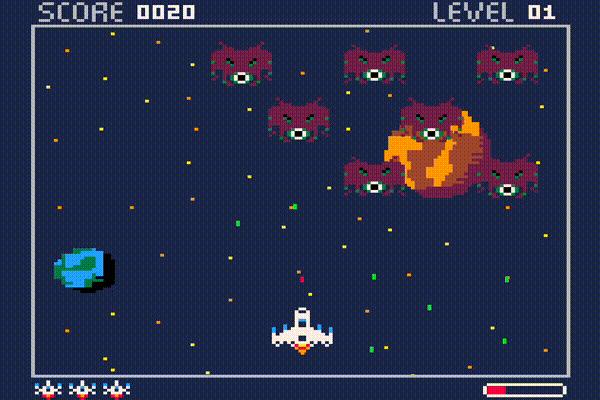

# PyInvaders



## Overview

This project is a Space Invaders clone created using Python and pygame.

## Prerequisites

Before you are able to run the game you will need to download pygame for python,
to do this go to the root of the repo and run the following command:

```shell
pip install -r requirements.txt
```

Once installed you will then need to enable pre-commit by running the following
command:

```shell
pre-commit install
```
